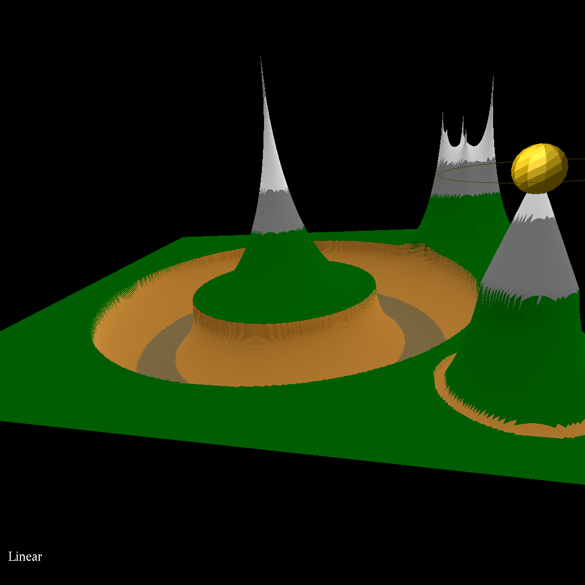
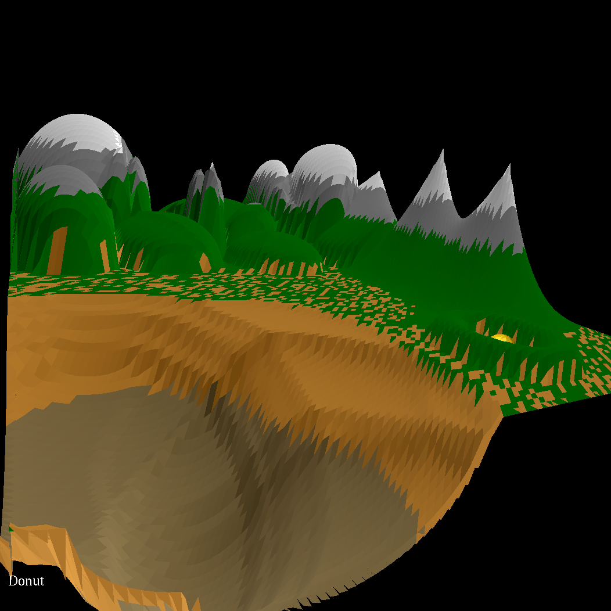
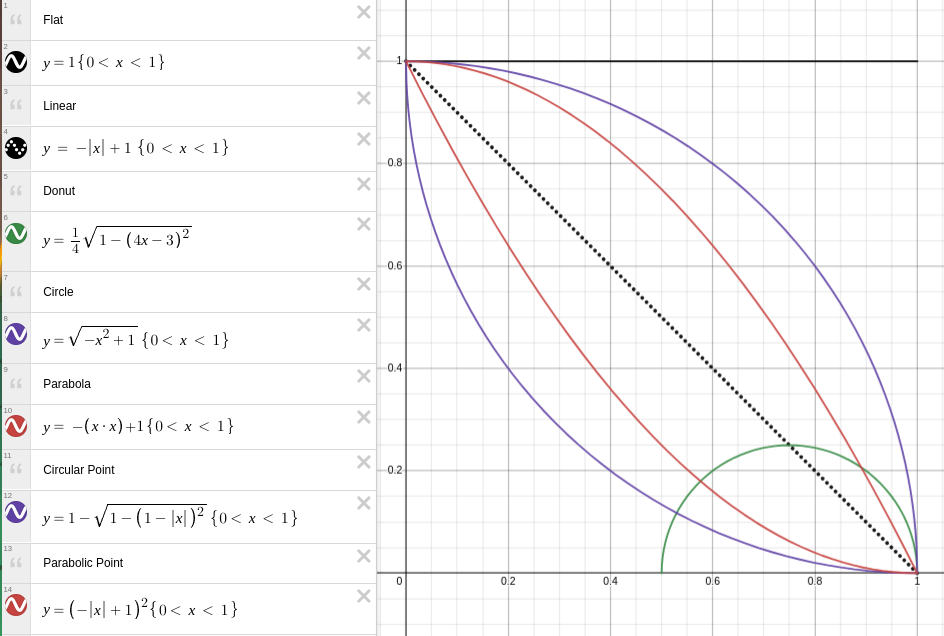
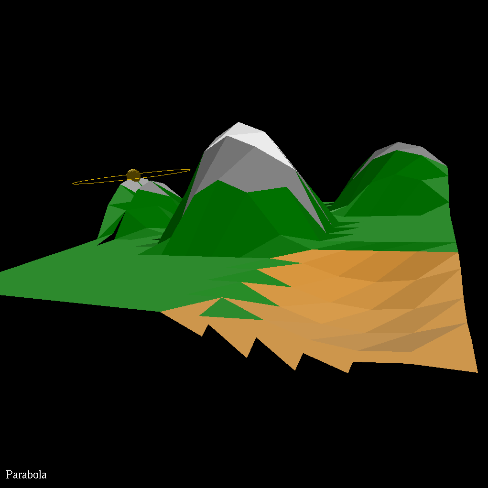
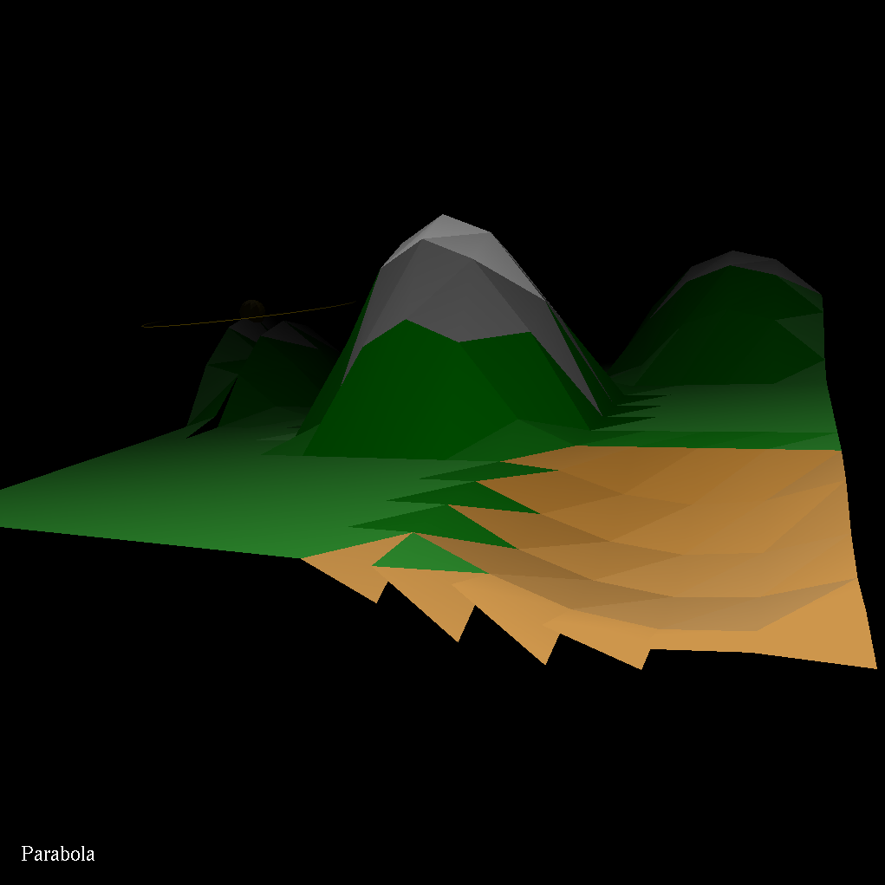

# TopoToucher

TopoToucher is a heightmap sandbox program for linux written in C++ with 
OpenGL. This was written using OpenGL, FreeGLUT, GLM, and helper libraries 
written by [Mike Bailey](https://web.engr.oregonstate.edu/~mjb). I have a
writeup about this project on my [website](https://vvill.dev/projects/topotoucher)

## Gallary

    
    
    

## Building

### Dependencies

- `g++`
- `make`
- `OpenGL`
- `GLEW`

### Build

`make`

### Run

`./TopoToucher [VERT_RESOLUTION]`

- `VERT_RESOLUTION`: Number of vertexes across the square in each direction.
Default 100. 

*Note that even numbers will not have a center vertex and the start
position will be rounded down and appear off-center towards (0,0)*

## Using

### Controls

All keyboard controls are caps-agnostic.

<kbd>Q</kbd> : Quit Program

<kbd>E</kbd> : Cycle Rolloff Functions

---

<kbd>W</kbd> : Push Vertex(es) Up

<kbd>S</kbd> : Push Vertex(es) Down

<kbd>A</kbd> : Decrease Influence Radius

<kbd>D</kbd> : Increase Influence Radius

---

<kbd>H</kbd> : Move Cursor Left

<kbd>J</kbd> : Move Cursor Forward

<kbd>K</kbd> : Move Cursor Backward

<kbd>L</kbd> : Move Cursor Right

---

<kbd>L-CLK</kbd> : Hold to Orbit

<kbd>Scroll</kbd> : Zoom in/out

<kbd>R-CLK</kbd> : Context Menu

- <kbd>Axis</kbd> : Enable/Disable center context axis
- <kbd>Axis Colors</kbd> : Change color of center context axis
- <kbd>Depth Cue</kbd> : Add additional depth-based darkening
- <kbd>Projection</kbd> : Change between Orthographic and Perspective views
- <kbd>Reset</kbd> : Reset all values including the heightmap, camera
position, and all values above
- <kbd>Debug</kbd> : Enables debug logging to console
- <kbd>Quit</kbd> : Close the program. Same as <kbd>Q</kbd>

### Rolloff Functions

    

An image of the currently implemented falloff equations is shown above. You 
can go to the interactive Desmos graph by clicking on the image or clicking
[here](https://www.desmos.com/calculator/wtvw4yahfq). The x value 
represents the distance from the currently selected vertex, and the y value
represents the value to be added/subtracted from that vertex. In TopoToucher,
the currently selected rolloff function can be found in white in the bottom
left corner of the screen.

### Lighting

TopoToucher uses a small ambient light, and an orbiting sun lamp to show
variation in topography. No user input is required to utilize these lights, and
the sun orbits automatically.
\
\
There is the option of enabling Depth Cue, using the right click context menu.
Turning on Depth Cue enables some OpenGL Fog (whose parameters are defined as 
constants at the start of `main.cpp`) which darkens the scene a bit, but will
make your angles a bit more prominent. Below are two images showing a map with
depth cue turned off (left, default) and turned on (right).

    
    

## Code

The base code for this program is stored in `/main.cpp`. Global variables are 
defined at the top of the file. Functions of note include:

- `Display` : Builds the heightmap mesh from the global array `Heights`, then 
draws everything to the screen
- `MoveVert` : Modifies the `Heights` array to influence vertexes on and around
`CurrentIndex`, based on the variable `Rolloff`, which is an index of 
`Rolloffs` enumerator
- `Keyboard` : Handles keyboard interrupts
- `InitMenus` : Configures the right click context menu
